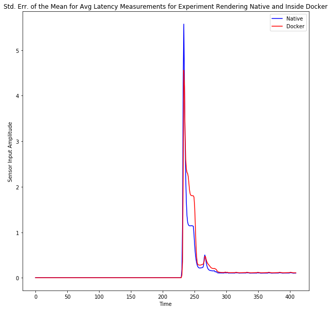

# psychomnipy
Platform Independant Psychopy for High Reproducibility

## Introduction

Most psychophysics experiments are written in PsychoPy and are tailored by the team of researchers to run properly on the target machine in their laboratory.

Since no two computers are identical in their configuration, it is not reasonable to expect an experiment written for one computer to run with absolutely no configuration changes on another machine. Normally, this effort ranges from mild to significant.

We try to address this problem by harnessing Linux Containers, specifically, Docker. Modern methodologies of software development and deployment have introduced a need for easy portability and quick deployment of software without any tweaking required for each specific machine.

We use this need of the software industry to address reproducibility challenges of Psychophysics experiments by preparing a standard example of using Docker to make experiments machine agnostic. We also demonstrate, through timing experiments, that the use of Docker does not add additional latency in the rendering of experimental stimuli.

## Latency Analysis

We ran latency tests to confirm the time taken for a square to be drawn on the screen between two EEG pulses. The square was detected by a light sensor. We found that the time taken to draw is identical. This practice was repeated for 1200 trials.

Across the 1200 trials, we found that the average rendering times and their standard error were consistent.

## How to Use

### Windows

In Windows, this can be used by using a Linux kernel, and installing xhost. However, we have not prepared instructions for using this on Windows, and this shall be future work.

### Linux

The repository has two folders, one for Nvidia based graphic cards and one for AMD or Open Source Drivers. Based on your machine, enter the relevant folder and follow Run and Build instructions provided below.

1. Open a Terminal Window (Ctrl + Alt + T)
2. Select your Linux Distro from the menu on the left on this page https://docs.docker.com/engine/. The Docker website provides clear and updated instructions on how to install.
3. Run the provided commands in a Terminal Window
4. Navigate to `NvidiaLinux` if you have Nvidia Drivers Or `OSDriverLinux` if you have AMD or Intel HD Graphics
5. Run `./build` to build the container
6. Run `./run` to run the experiment from inside the container

## How to Reuse

Steps to reuse the Dockerfile
1. Enter your required Linux packages in line 7
2. Enter your required Python packages in line 26
3. Clone your repo in line 29
4. Provide the file path to your experiment file in line 32

## Further Help

Should you need further assistance, or have questions, please contact

1. Zora Nolte (zora.nolte@gmail.com)
2. Hunaid Hameed (hhameed@uni-osnabrueck.de)

